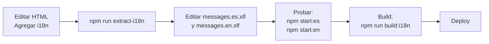

# Internacionalización (i18n) - Estado Actual

## ✅ Completado

Se ha implementado exitosamente el sistema de internacionalización (i18n) en el proyecto supermarket-frontend. El sistema permite servir la aplicación en **español** e **inglés**.

### Cambios Realizados

1. **Dependencias Instaladas**
   - `@angular/localize@^16.2.12` - Para soporte de i18n nativo
   - `@popperjs/core@^2.11.8` - Dependencia faltante de ng-bootstrap

2. **Configuración de Angular**
   - Actualizado `angular.json` con configuración i18n
   - Agregadas configuraciones de build y serve para cada idioma
   - Español es el idioma por defecto

3. **Scripts NPM**
   - `npm start` o `npm start:es` - Servir en español (puerto 4200)
   - `npm start:en` - Servir en inglés (puerto 4201)
   - `npm run extract-i18n` - Extraer strings de traducción
   - `npm run build:i18n` - Build para producción (ambos idiomas)

4. **Archivos de Traducción**
   - `src/locale/messages.xlf` - Fuente (generado automáticamente)
   - `src/locale/messages.es.xlf` - Español
   - `src/locale/messages.en.xlf` - Inglés (con traducciones básicas)

5. **Atributos i18n Agregados**
   - Login component - Todos los campos de formulario
   - Main component - Navegación y botones
   - Message dialog - Títulos y botones
   - Pedidos list - Títulos y filtros
   - Proveedores cards - Títulos y formularios

6. **Documentación Creada**
   - `I18N-IMPLEMENTATION-GUIDE.md` - Guía técnica completa
   - `I18N-TRANSLATION-GUIDE.md` - Guía para traducir
   - `I18N-README.md` - Este archivo

## 🚀 Cómo Usar

### Para Desarrollo

**Español (Recomendado por defecto):**
```bash
npm start
```
Accede a: http://localhost:4200

**Inglés:**
```bash
npm start:en
```
Accede a: http://localhost:4201

### Agregar Nuevas Traducciones

1. Edita los templates HTML y agrega el atributo `i18n`:
   ```html
   <h1 i18n="Page title">Mi Título</h1>
   <button i18n="Submit button">Enviar</button>
   ```

2. Extrae las nuevas strings:
   ```bash
   npm run extract-i18n
   ```

3. Edita los archivos de traducción:
   - `src/locale/messages.es.xlf` (español)
   - `src/locale/messages.en.xlf` (inglés)

### Para Producción

```bash
npm run build:i18n
```

Genera dos builds:
- `dist/supermarket-frontend/es/` - Versión en español
- `dist/supermarket-frontend/en/` - Versión en inglés

## 📝 Estado de Traducciones

### Completado (Español)
- ✅ Login form - Todos los campos y validaciones
- ✅ Navegación principal
- ✅ Diálogos de mensaje
- ✅ Página de pedidos
- ✅ Página de proveedores
- ✅ Botones comunes

### Completado (Inglés)
- ✅ Traducciones básicas para los componentes principales
- ✅ Strings de ng-bootstrap traducidos

### Pendiente
- ⏳ Traducir completamente el archivo `messages.en.xlf`
- ⏳ Agregar i18n a más componentes (productos, detalles, etc.)
- ⏳ Traducir mensajes de error dinámicos (actualmente en TypeScript)

## 🔄 Flujo de Traducción Típico



## 📚 Archivos Importantes

```
src/
├── locale/
│   ├── messages.xlf           # Fuente (genera automáticamente)
│   ├── messages.es.xlf        # Traducción al español
│   └── messages.en.xlf        # Traducción al inglés
├── app/
│   ├── pages/
│   │   ├── login/             # i18n agregado ✅
│   │   ├── pedidos-list/      # i18n agregado ✅
│   │   └── proveedores-cards/ # i18n agregado ✅
│   ├── main/
│   │   └── main.component.html # i18n agregado ✅
│   └── core/
│       └── components/
│           └── message-dialog/ # i18n agregado ✅
├── angular.json               # Configuración i18n ✅
└── package.json               # Scripts i18n ✅

xliffmerge.json               # Configuración de merge ✅
I18N-IMPLEMENTATION-GUIDE.md  # Guía técnica
I18N-TRANSLATION-GUIDE.md     # Guía de traducción
I18N-README.md                # Este archivo
```

## 💡 Consejos

1. **Mantén las traducciones cerca del código**: Los atributos `i18n` van en los templates donde se usan.

2. **Usa descripciones significativas**: Agrega contexto en el atributo `i18n`:
   ```html
   <!-- ❌ Malo -->
   <button i18n>Guardar</button>

   <!-- ✅ Bien -->
   <button i18n="Save order button">Guardar</button>
   ```

3. **No traduzcas dinámicamente en TypeScript**: El i18n de Angular está diseñado para templates. Para textos dinámicos, mantén el código en español o usa una librería como `ngx-translate`.

4. **Mantén la estructura de directorios limpia**: Los archivos XLIFF van en `src/locale/`.

5. **Test en ambos idiomas**: Antes de mergear, prueba la app en:
   - http://localhost:4200 (español)
   - http://localhost:4201 (inglés)

## 🔗 Referencias

- [Documentación oficial de Angular i18n](https://angular.io/guide/i18n-common)
- [XLIFF Format Specification](http://docs.oasis-open.org/xliff/v1.2/os/xliff-core.html)
- [Guía de Implementación](./I18N-IMPLEMENTATION-GUIDE.md)
- [Guía de Traducción](./I18N-TRANSLATION-GUIDE.md)

## ⚠️ Limitaciones Conocidas

1. **Build-time compilation**: Las traducciones se compilan en tiempo de construcción, no en tiempo de ejecución. Debes hacer un build separado para cada idioma.

2. **Cambio de idioma dinámico**: No hay un selector de idioma dinámico en la UI. Usa diferentes URLs:
   - Español: `/` o `localhost:4200`
   - Inglés: `/en/` o `localhost:4201`

3. **Traducciones en TypeScript**: Los métodos con traducciones dinámicas en TypeScript requieren el uso de `$localize()` (más complejo).

## 🎯 Próximos Pasos Recomendados

1. Completar traducciones al inglés en `messages.en.xlf`
2. Agregar i18n a componentes faltantes (productos, detalles)
3. Considerar agregar selector de idioma en la navbar
4. Implementar redirección automática de idioma según preferencia del navegador
5. Probar en ambos idiomas antes de cada release

## 📞 Soporte

Para más detalles sobre cómo traducir strings específicos:
- Consulta `I18N-TRANSLATION-GUIDE.md`
- Revisa ejemplos en los archivos XLIFF existentes
- Verifica la documentación de Angular i18n

---

**Última actualización**: 2025-12-13
**Status**: ✅ Implementación Completa - Lista para traducción
